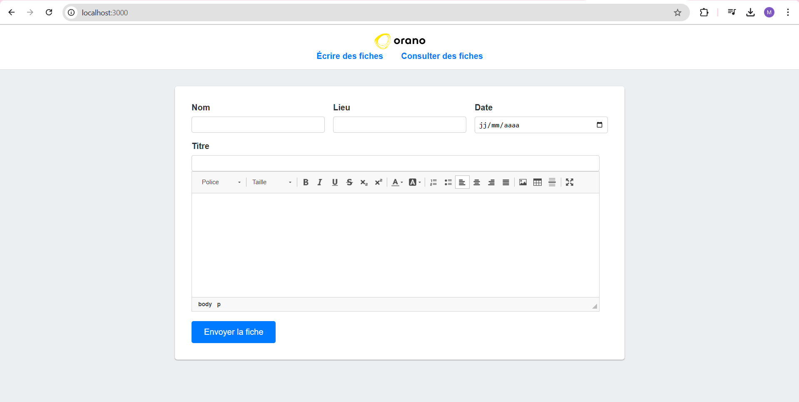
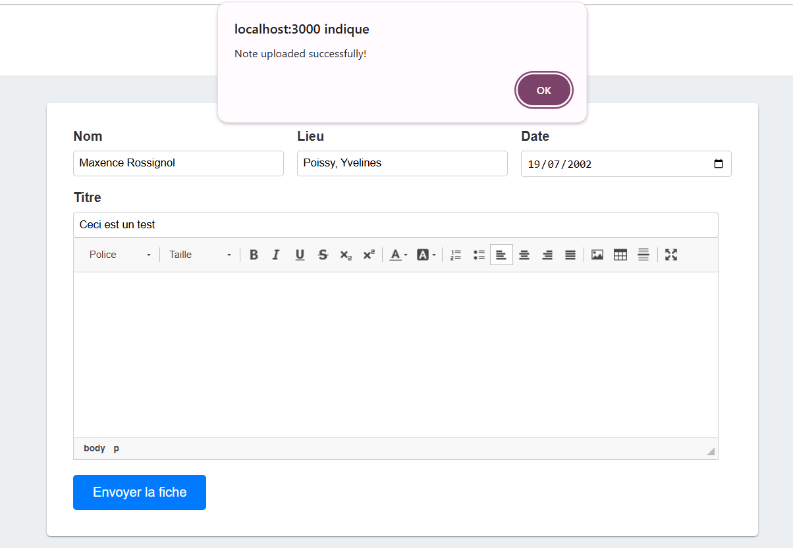
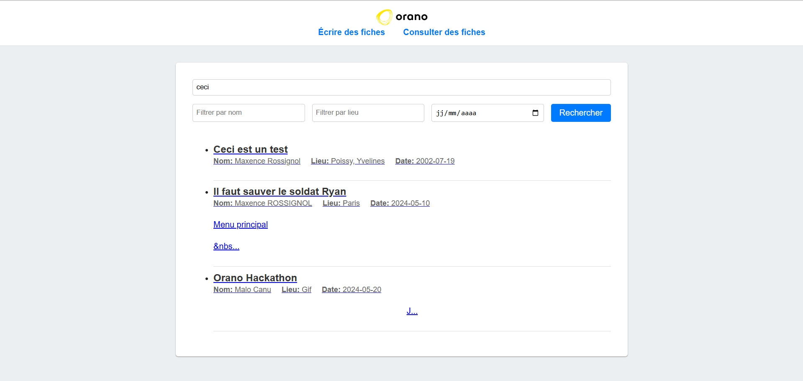
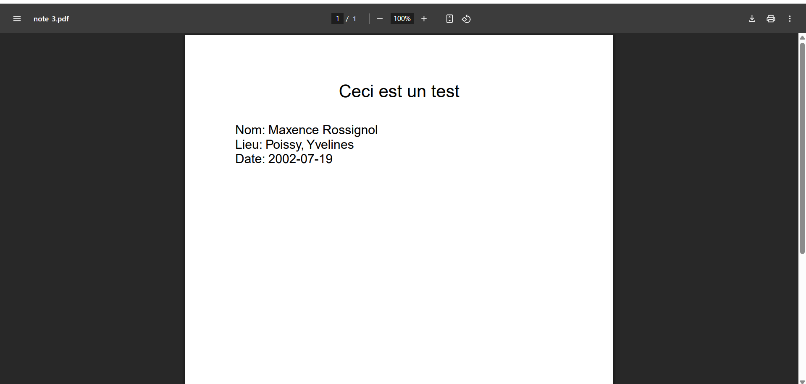

# T-REX (Technical Return of Experience)

**Disclaimer:** This project was created in around 6 hours for a hackathon with Orano. As I was discovering many technologies during this process, the code should be considered as a proof of concept rather than production-ready code.

## Project Overview

T-REX is a Progressive Web Application (PWA) designed to manage and search through "Fiches de retour d'experience" (Experience Feedback Forms) for Orano. The application combines modern web technologies with machine learning to provide an intelligent document management system.

## Key Features

### 1. Document Upload
- Create and submit experience feedback forms
- Rich text editing capabilities using CKEditor
- Automatic text embedding using BERT model
- Offline support through Service Workers and IndexedDB

### 2. Smart Search System
- Vector-based semantic search using BERT embeddings
- Multiple filtering options:
  - Keyword search
  - Name filter
  - Location filter
  - Date filter
- Intelligent content and title matching

### 3. PDF Export
- Download submitted forms as PDF documents
- Formatted for easy reading and sharing

## Technical Stack

- **Frontend:**
  - HTML5, CSS3, JavaScript
  - Progressive Web App (PWA) capabilities
  - CKEditor for rich text editing
  - Service Workers for offline functionality

- **Backend:**
  - Node.js with Express
  - TensorFlow.js for BERT embeddings
  - SQLite3 for data storage
  - PDFKit for PDF generation

- **Key Dependencies:**
  - @tensorflow-models/universal-sentence-encoder
  - @tensorflow/tfjs
  - express
  - pdfkit
  - sqlite3

## Screenshots

<div align="center">
  <h3>Creating a New Experience Form</h3>
  
  <p><em>The main interface for creating new experience feedback forms with rich text editing capabilities</em></p>
  
  <h3>Successful Upload Confirmation</h3>
  
  <p><em>Confirmation message shown after successful form submission</em></p>
  
  <h3>Notes Display and Search Interface</h3>
  
  <p><em>Interface for searching and viewing existing experience feedback forms with multiple filter options</em></p>
  
  <h3>PDF Export View</h3>
  
  <p><em>Example of an exported experience feedback form in PDF format</em></p>
</div>

## Installation

1. Clone the repository
2. Install dependencies:
```bash
npm install
```
3. Start the server:
```bash
node src/server.js
```

## Offline Capabilities

The application includes offline support through:
- Service Workers for caching static assets
- IndexedDB for storing documents when offline
- Background sync to upload cached documents when connection is restored

## Future Improvements

Given the hackathon time constraints, several areas could be improved:
- Enhanced error handling
- Better test coverage
- Improved UI/UX
- Security enhancements
- Code optimization
- Add proper npm scripts in package.json
